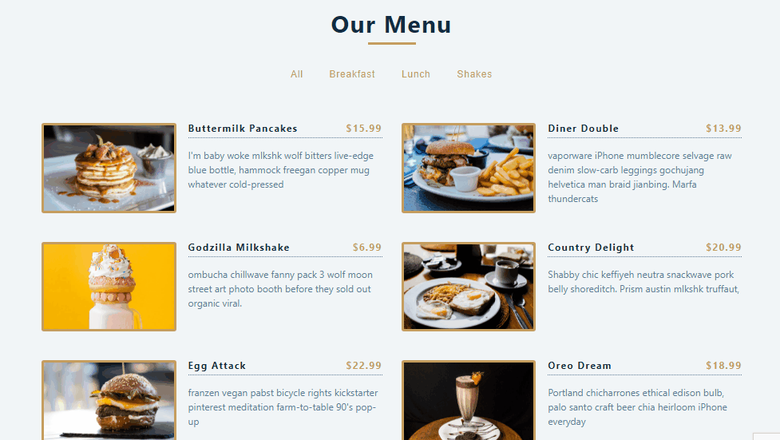

### React Filter Navigation

[view page](https://femi-ologunwa.github.io/5-filterable-list-nav/)

### Implementation

-  Fetching data items from a file into state with `useState`
-  Rendering list of data items as components
-  Created a function to filter items in a list based on category
-  Created a function to get unique values from a list of values
-  Dynamically generate a set of buttons based on a particular property of all data items.
